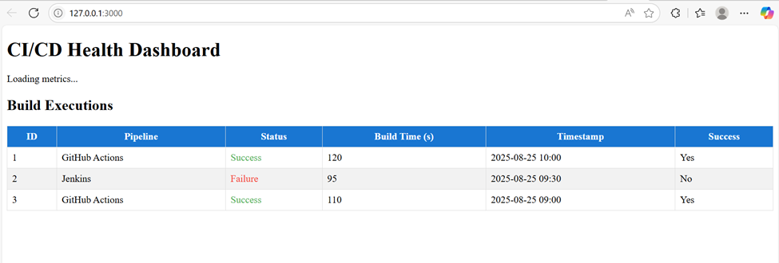

# CI/CD Pipeline Health Dashboard



## Application Architecture Summary

This project is a 3-tier web application for monitoring CI/CD pipeline executions. It provides a real-time dashboard to visualize pipeline metrics, list build executions, and send email notifications on failures. The application is fully containerized using Docker Compose.

**Architecture Overview:**
- **Frontend (React.js):** User interface for dashboard and build list
- **Backend (FastAPI):** REST API for metrics, builds, and notifications
- **Database (PostgreSQL):** Stores build execution records
- **Email Notification:** Sends email to configured recipient on pipeline failure
- **Docker Compose:** Orchestrates all services
- **Development Environment:** GitHub Codespaces

```
[User] <-> [React Frontend] <-> [FastAPI Backend] <-> [PostgreSQL DB]
                                 |
                                 +--[Gmail SMTP]
```

## Setup and Run Instructions

### Prerequisites
- Docker and Docker Compose installed
- Gmail account for email notifications

### Configuration
1. Edit `docker-compose.yml` and set the following environment variables under the `backend` service:
   - `SMTP_SENDER_EMAIL`: Your Gmail address
   - `NOTIFY_EMAIL`: Recipient email address for notifications

2. (Optional) Update frontend/backend/database settings as needed.

### Build and Start the Application

```bash
docker compose down && docker compose up --build
```

- The frontend will be available at `http://localhost:3000`
- The backend API will be available at `http://localhost:8000`

### Usage
- View pipeline metrics and build executions on the dashboard
- On pipeline failure, an email notification will be sent to the configured recipient

### Stopping the Application

```bash
docker compose down
```

---
For more details, see the `docs/` folder for requirement analysis and technical design documents.

## How AI tools were used
The AI tools used for making this application are -
- GitHub Copilot (GPT-4.1)
- ChatGpt
ChatGpt was used for getting initial overview of product like how the source code repository should be structured and to know about the various steps needed for building the application.
GitHub Copilot has been used for making the product source codes and for debugging the issues which could have occured while building the application.

## Key Learning
Below are the major learnings while building this application-
- How to use AI for building any application from scratch.
- How to use AI tools for debugging issues which could occur while building any application.
- How to use prompts effectively.

## Assumptions
- The application is a three-tier application.
- The only alerting channel is Mail. 